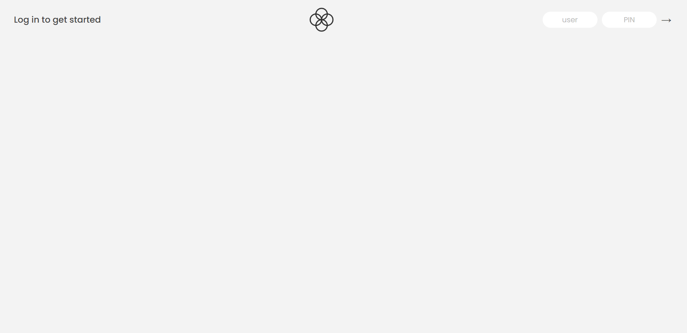
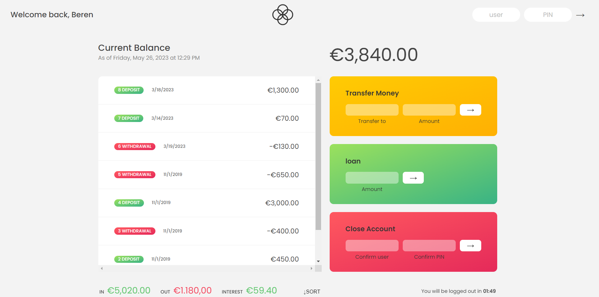

# 🌿Bankist App Project

Logic of the app:
Bankist app is a bank app that users can control their balance, make money transfers, make loan requests.

# Built with

Project is built with HTML, CSS, JavaScript.

# Reach Bankist App

You can reach the project here, [Bankistapp](https://bankistappberen.netlify.app/)
To log in the app, you need to type user and pin. Please use these to login:
user: bv
pin:1111

# Visual of the project

Login page of the app

Main page of the app

# Acknowledgments

Project is built during the course in Udemy.
The Complete JavaScript Course 2023: From Zero to Expert! by Jonas Schmedtmann.
